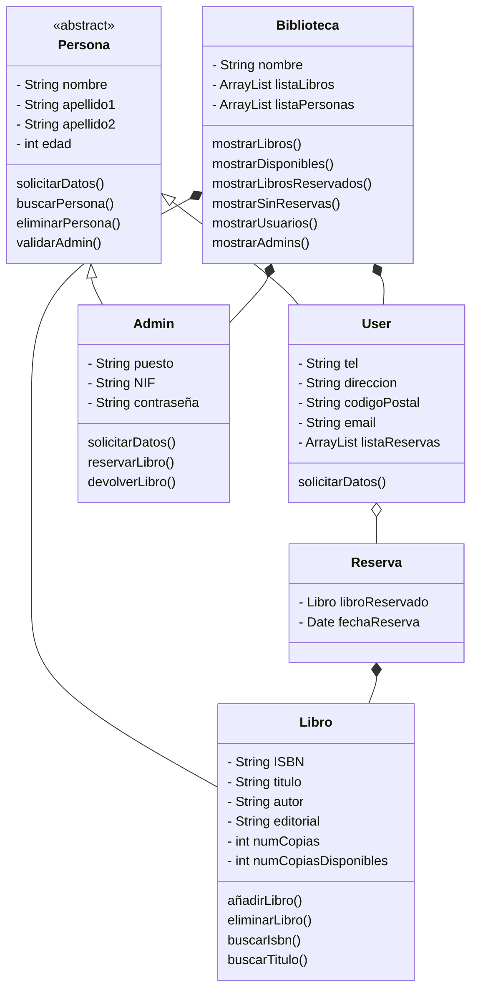

# Library management system exercise

Exercice for programming topic in the 1st year of Web App Development course from CIFP Francesc de Borja Moll.

The exercice is made in Java to aquire the OOP concepts.

It consists in create several classes such as Book, User, Admin, Library... Each class has its own methods which are called from the main menu. The menu also includes an admin menu that needs a basic authentication to log in.

The exercise includes abstract classes and different relationships between classes.

